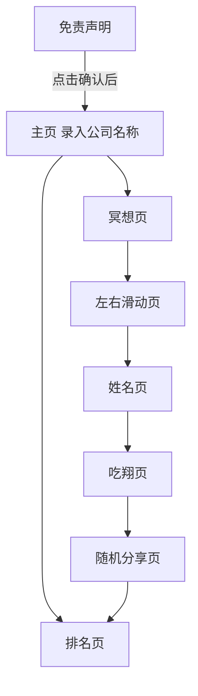

# come_on_asshole
A workplace arena that puts assholes to shame

## 页面

一共有8个页面

逻辑



### Page1
显示,人生如戏,全是意外
点击同意后进入page2

### Page2
输入公司名称,最多5个汉字字符
同时在数据库中动态查询公司表,输入两个字符后开始查询,以下拉列表显示相似的选项
点击确认进入下一页

### Page4
动态显示,淡入淡出
默念那个公司里翔王的名字
脑海里全是Ta那猥琐的身影
完了,挥之不去了
播放完毕后进入下一页

### Page5
显示提示,左滑确定,右滑否定
然后依次以卡片形式以优雅的形式显示以下选项,同时记录用户的选择在变量中vote_details
```json
[
    {
        "type_cn": "甩锅侠 —— 责任推卸专家",
        "type_en": "Buck-Passer —— The Accountability Evader",
        "score": 13,
        "rating_cn": "组织癌症级",
        "rating_en": "Organizational Cancer",
        "description_cn": "系统性摧毁责任伦理与委托-代理信任，瓦解团队协作的契约基础，导致优秀人才流失与组织免疫机制崩溃",
        "description_en": "Systematically destroys accountability ethics and principal-agent trust, dismantles the contractual foundation of teamwork, leading to brain drain and organizational immune system collapse"
    },
    {
        "type_cn": "成果窃贼 —— 知识产权掠夺者",
        "type_en": "Credit Thief —— The Intellectual Plunderer",
        "score": 11,
        "rating_cn": "剧毒水母级",
        "rating_en": "Venomous Jellyfish",
        "description_cn": "破坏知识分配的公平感与正义原则，抑制团队知识共享意愿，引发公地悲剧式创新萎缩",
        "description_en": "Undermines distributive justice and fairness in knowledge attribution, suppresses willingness to share knowledge, triggers tragedy-of-the-commons style innovation atrophy"
    },
    {
        "type_cn": "马屁精 —— 权力依附型人格",
        "type_en": "Sycophant —— The Power Parasite",
        "score": 11,
        "rating_cn": "信号扭曲级",
        "rating_en": "Signal Distortion",
        "description_cn": "系统性扭曲组织价值观与信号传递机制，导致劣币驱逐良币，使实干者产生相对剥夺感",
        "description_en": "Systematically distorts organizational values and signal transmission mechanisms, drives out good currency with bad, creates relative deprivation among high performers"
    },
    {
        "type_cn": "双面阴阳人 —— 人格分裂者",
        "type_en": "Two-Faced —— The Duality Master",
        "score": 11,
        "rating_cn": "信任崩解级",
        "rating_en": "Trust Disintegrator",
        "description_cn": "摧毁组织沟通效率与心理安全感，制造信息不对称与信任危机，大幅增加交易成本",
        "description_en": "Destroys organizational communication efficiency and psychological safety, creates information asymmetry and trust crises, significantly increases transaction costs"
    },
    {
        "type_cn": "负能量黑洞 —— 情绪吸血鬼",
        "type_en": "Energy Vampire —— The Negativity Black Hole",
        "score": 10,
        "rating_cn": "情感瘟疫级",
        "rating_en": "Emotional Plague",
        "description_cn": "持续消耗团队情绪资源与认知带宽，抑制创新尝试，诱发习得性无助的组织氛围",
        "description_en": "Continuously drains team emotional resources and cognitive bandwidth, inhibits innovation attempts, induces organizational atmosphere of learned helplessness"
    },
    {
        "type_cn": "八卦制造机 —— 职场情报贩子",
        "type_en": "Gossip Monger —— The Information Trafficker",
        "score": 10,
        "rating_cn": "隐私破坏级",
        "rating_en": "Privacy Destroyer",
        "description_cn": "破坏心理安全边界与隐私保护，制造恐惧氛围与相互猜疑，阻碍真实信息流通",
        "description_en": "Destroys psychological safety boundaries and privacy protection, creates atmosphere of fear and mutual suspicion, obstructs flow of authentic information"
    },
    {
        "type_cn": "微观控制狂 —— 不信任传播者",
        "type_en": "Micromanager —— The Distrust Spreader",
        "score": 9,
        "rating_cn": "成长抑制级",
        "rating_en": "Growth Suppressor",
        "description_cn": "抑制员工自主性成长与创造力，降低组织敏捷性，导致管理者陷入微观事务陷阱",
        "description_en": "Suppresses employee autonomous growth and creativity, reduces organizational agility, traps managers in micro-transaction quagmires"
    },
    {
        "type_cn": "划水摸鱼师 —— 公平感破坏者",
        "type_en": "Freeloader —— The Fairness Disruptor",
        "score": 9,
        "rating_cn": "公平腐蚀级",
        "rating_en": "Fairness Corroder",
        "description_cn": "破坏绩效分配的公平感知，引发社会惰化效应，增加高绩效者的相对剥夺感与离职倾向",
        "description_en": "Undermines perceived fairness in performance distribution, triggers social loafing effects, increases relative deprivation and turnover intention among high performers"
    },
    {
        "type_cn": "会议寄生虫 —— 时间杀手",
        "type_en": "Meeting Parasite —— The Time Killer",
        "score": 8,
        "rating_cn": "效能耗散级",
        "rating_en": "Efficiency Dissipator",
        "description_cn": "造成组织时间贫困与注意力碎片化，通过虚假忙碌掩盖真实效率低下，抑制深度工作",
        "description_en": "Creates organizational time poverty and attention fragmentation, masks real inefficiency with performative busyness, suppresses deep work"
    },
    {
        "type_cn": "刺猬防御者 —— 玻璃心巨人",
        "type_en": "Porcupine —— The Glass Giant",
        "score": 8,
        "rating_cn": "沟通摩擦级",
        "rating_en": "Communication Friction",
        "description_cn": "阻碍组织学习反馈循环与复盘文化，抑制问题讨论与批判性思维，增加沟通摩擦成本",
        "description_en": "Obstructs organizational learning feedback loops and retrospective culture, suppresses problem discussion and critical thinking, increases communication friction costs"
    }
]
```
确认或否认时有炫酷的动画


### page6
输入姓名,同步在下方显示掩码后的名字,参考以下python算法
```python
import hashlib
from typing import List, Dict, Optional

class PhoneticNameMasker:
    """
    读音保持的一致性姓名脱敏器
    
    特性：
    - 相同输入+相同seed = 相同输出（确定性）
    - 替换为同音/近音汉字（读音保持）
    - 支持复姓（欧阳、司马等）
    - 可配置映射表
    """
    
    def __init__(self, seed: str = "default_seed_v1.0"):
        """
        初始化脱敏器
        
        Args:
            seed: 确定性种子，不同种子会产生不同的映射结果
        """
        self.seed = seed
        
        # 常见姓氏同音字映射（覆盖百家姓前100+）
        self.surname_map = {
            '张': ['章', '彰', '漳', '獐', '璋', '嫜'],
            '王': ['汪', '亡', '枉', '网', '往', '罔'],
            '李': ['理', '里', '礼', '哩', '俚', '娌'],
            '刘': ['流', '留', '刘', '琉', '榴', '镏'],
            '陈': ['晨', '辰', '臣', '尘', '忱', '沈'],
            '杨': ['阳', '洋', '羊', '扬', '佯', '疡'],
            '黄': ['皇', '煌', '凰', '惶', '蝗', '璜'],
            '赵': ['照', '兆', '罩', '赵', '肇', '诏'],
            '周': ['洲', '州', '舟', '粥', '诌', '侜'],
            '吴': ['无', '吾', '梧', '芜', '蜈', '浯'],
            '徐': ['许', '旭', '序', '恤', '絮', '煦'],
            '孙': ['损', '笋', '荪', '狲', '飧', '猻'],
            '马': ['码', '玛', '蚂', '妈', '吗', '犸'],
            '朱': ['珠', '株', '猪', '诸', '铢', '茱'],
            '胡': ['湖', '糊', '蝴', '瑚', '葫', '猢'],
            '郭': ['锅', '国', '帼', '虢', '蝈', '聒'],
            '何': ['河', '禾', '合', '和', '核', '盍'],
            '高': ['膏', '糕', '篙', '睾', '槁', '缟'],
            '林': ['淋', '琳', '霖', '磷', '鳞', '嶙'],
            '罗': ['萝', '逻', '锣', '箩', '螺', '骡'],
            '郑': ['正', '证', '政', '挣', '症', '郑'],
            '梁': ['粮', '粱', '凉', '量', '谅', '踉'],
            '谢': ['卸', '泻', '屑', '蟹', '懈', '榭'],
            '宋': ['送', '颂', '诵', '讼', '宋', '忪'],
            '唐': ['堂', '塘', '糖', '膛', '棠', '溏'],
            '许': ['徐', '旭', '序', '恤', '絮', '煦'],
            '韩': ['寒', '含', '函', '涵', '邯', '晗'],
            '冯': ['逢', '缝', '凤', '奉', '俸', '沣'],
            '曹': ['槽', '漕', '嘈', '艚', '螬', '褿'],
            '彭': ['朋', '鹏', '棚', '硼', '篷', '澎'],
            '曾': ['增', '憎', '赠', '缯', '罾', '甑'],
            '肖': ['消', '销', '宵', '萧', '潇', '箫'],
            '田': ['填', '甜', '恬', '畋', '阗', '畑'],
            '董': ['懂', '动', '冻', '栋', '洞', '恫'],
            '袁': ['原', '圆', '园', '援', '缘', '塬'],
            '潘': ['攀', '盘', '磐', '蟠', '蹒', '爿'],
            '于': ['余', '鱼', '愉', '渝', '瑜', '渝'],
            '蒋': ['讲', '奖', '桨', '匠', '酱', '犟'],
            '蔡': ['菜', '才', '材', '财', '裁', '裁'],
            '杜': ['度', '渡', '肚', '妒', '镀', '蠹'],
            '叶': ['业', '页', '夜', '液', '晔', '烨'],
            '程': ['成', '城', '诚', '承', '呈', '丞'],
            '魏': ['卫', '味', '位', '畏', '胃', '谓'],
            '薛': ['学', '穴', '雪', '血', '谑', '踅'],
            '范': ['犯', '饭', '泛', '贩', '梵', '畈'],
            '丁': ['盯', '叮', '钉', '顶', '鼎', '锭'],
            '沈': ['审', '婶', '肾', '慎', '渗', '椹'],
            '姚': ['摇', '遥', '瑶', '窑', '谣', '鳐'],
            '傅': ['付', '负', '妇', '附', '咐', '驸'],
            '卢': ['炉', '庐', '芦', '颅', '鲈', '垆'],
            '戴': ['带', '代', '待', '袋', '贷', '黛'],
            '夏': ['下', '吓', '厦', '暇', '瑕', '罅'],
            '钟': ['中', '忠', '终', '盅', '衷', '锺'],
            '廖': ['料', '廖', '撂', '镣', '尥', '钌'],
            '石': ['时', '识', '实', '拾', '食', '蚀'],
            '熊': ['雄', '凶', '胸', '匈', '汹', '芎'],
            '金': ['今', '巾', '斤', '禁', '襟', '矜'],
            '陆': ['录', '鹿', '路', '露', '禄', '漉'],
            '郝': ['好', '号', '昊', '浩', '耗', '镐'],
            '孔': ['恐', '空', '控', '倥', '崆', '箜'],
            '白': ['百', '柏', '伯', '泊', '舶', '帛'],
            '崔': ['催', '摧', '崔', '璀', '瘁', '摧'],
            '康': ['慷', '糠', '扛', '亢', '抗', '炕'],
            '毛': ['茅', '矛', '锚', '髦', '蟊', '旄'],
            '邱': ['秋', '丘', '蚯', '邱', '鳅', '湫'],
            '秦': ['琴', '勤', '芹', '擒', '禽', '芩'],
            '江': ['将', '姜', '浆', '僵', '疆', '缰'],
            '史': ['使', '始', '驶', '矢', '屎', '豕'],
            '顾': ['故', '固', '估', '姑', '孤', '沽'],
            '侯': ['候', '猴', '喉', '篌', '糇', '瘊'],
            '邵': ['少', '绍', '哨', '捎', '梢', '稍'],
            '孟': ['梦', '猛', '蒙', '锰', '蜢', '懵'],
            '龙': ['隆', '笼', '聋', '咙', '珑', '胧'],
            '万': ['玩', '完', '顽', '丸', '宛', '惋'],
            '段': ['断', '缎', '锻', '椴', '煅', '簖'],
            '雷': ['累', '蕾', '垒', '诔', '磊', '漯'],
            '钱': ['前', '潜', '浅', '遣', '谴', '缱'],
            '汤': ['唐', '堂', '塘', '糖', '膛', '棠'],
            '尹': ['引', '隐', '印', '饮', '蚓', '殷'],
            '易': ['义', '艺', '亿', '忆', '议', '亦'],
            '黎': ['离', '璃', '梨', '狸', '骊', '藜'],
            '向': ['项', '象', '像', '橡', '蟓', '饷'],
            '常': ['长', '场', '肠', '尝', '偿', '徜'],
            # 复姓支持
            '欧阳': ['欧杨', '鸥阳', '瓯阳', '讴阳'],
            '司马': ['思马', '丝马', '死马', '四马'],
            '上官': ['尚官', '上关', '赏官', '上官'],
            '东方': ['冬方', '懂方', '动方', '栋方'],
            '诸葛': ['诸哥', '朱哥', '猪哥', '竹哥'],
            '皇甫': ['黄甫', '凰甫', '煌甫', '惶甫'],
        }
        
        # 常用名字汉字同音字映射
        self.name_char_map = {
            '三': ['散', '伞', '叁', '毵', '馓'],
            '伟': ['尾', '纬', '苇', '娓', '玮', '韪'],
            '明': ['名', '鸣', '铭', '茗', '酩', '溟'],
            '强': ['墙', '蔷', '抢', '襁', '锖', '樯'],
            '磊': ['累', '蕾', '垒', '诔', '漯', '耒'],
            '静': ['净', '境', '敬', '径', '靖', '痉'],
            '丽': ['力', '利', '立', '厉', '吏', '砾'],
            '敏': ['悯', '闽', '皿', '抿', '悯', '愍'],
            '娜': ['拿', '哪', '纳', '钠', '衲', '捺'],
            '婷': ['停', '亭', '庭', '廷', '霆', '蜓'],
            '浩': ['耗', '昊', '皓', '灏', '暭', '颢'],
            '杰': ['洁', '结', '捷', '竭', '睫', '羯'],
            '文': ['纹', '蚊', '雯', '紊', '汶', '玟'],
            '华': ['化', '话', '划', '画', '桦', '骅'],
            '国': ['果', '裹', '椁', '蜾', '褁', '猓'],
            '平': ['评', '凭', '苹', '坪', '萍', '枰'],
            '海': ['害', '亥', '骇', '氦', '咳', '孩'],
            '军': ['君', '均', '钧', '菌', '筠', '麇'],
            '建': ['见', '件', '健', '剑', '鉴', '溅'],
            '志': ['制', '治', '质', '致', '秩', '挚'],
            '刚': ['钢', '纲', '缸', '肛', '岗', '冈'],
            '峰': ['锋', '风', '枫', '丰', '封', '疯'],
            '宇': ['雨', '语', '羽', '与', '屿', '圉'],
            '欣': ['心', '新', '辛', '薪', '馨', '锌'],
            '然': ['燃', '染', '髯', '蚺', '苒', '冉'],
            '佳': ['家', '加', '嘉', '枷', '珈', '镓'],
            '雨': ['宇', '语', '羽', '与', '屿', '圉'],
            '晨': ['辰', '臣', '尘', '陈', '忱', '宸'],
            '阳': ['杨', '洋', '羊', '扬', '佯', '炀'],
            '洋': ['阳', '杨', '羊', '扬', '佯', '烊'],
            '涛': ['滔', '韬', '焘', '饕', '绦', '韬'],
            '波': ['播', '拨', '钵', '玻', '菠', '剥'],
            '鹏': ['朋', '棚', '硼', '篷', '澎', '膨'],
            '飞': ['非', '菲', '啡', '绯', '扉', '霏'],
            '鑫': ['心', '新', '辛', '欣', '馨', '锌'],
            '亮': ['量', '谅', '辆', '晾', '踉', '靓'],
            '勇': ['永', '咏', '泳', '俑', '蛹', '踊'],
            '艳': ['燕', '验', '厌', '宴', '晏', '堰'],
            '娟': ['捐', '鹃', '涓', '娟', '镌', '蠲'],
            '玲': ['零', '铃', '龄', '陵', '菱', '绫'],
            '丹': ['单', '担', '眈', '耽', '聃', '儋'],
            '萍': ['平', '评', '凭', '苹', '坪', '枰'],
            '辉': ['灰', '挥', '恢', '徽', '晖', '辉'],
            '凯': ['慨', '楷', '铠', '剀', '垲', '锴'],
            '斌': ['宾', '滨', '缤', '槟', '镔', '膑'],
            '雪': ['血', '穴', '谑', '削', '靴', '薛'],
            '颖': ['影', '颖', '瘿', '郢', '颍', '颖'],
            '梅': ['没', '媒', '枚', '眉', '莓', '嵋'],
            '宁': ['凝', '咛', '狞', '柠', '聍', '咛'],
            '欣': ['心', '新', '辛', '馨', '锌', '莘'],
            '怡': ['宜', '移', '遗', '疑', '仪', '夷'],
            '慧': ['惠', '绘', '卉', '惠', '秽', '讳'],
            '瑶': ['摇', '遥', '窑', '谣', '鳐', '徭'],
            '琳': ['淋', '霖', '磷', '鳞', '嶙', '辚'],
        }
    
    def _get_hash_index(self, original: str, options: List[str]) -> int:
        """
        基于原始字符和种子生成确定性索引
        """
        # 组合种子和原字符生成哈希
        hash_input = f"{self.seed}|{original}"
        hash_hex = hashlib.sha256(hash_input.encode('utf-8')).hexdigest()
        hash_int = int(hash_hex, 16)
        return hash_int % len(options)
    
    def mask(self, name: str) -> str:
        """
        对姓名进行脱敏处理
        
        Args:
            name: 真实姓名（2-4个汉字，支持复姓）
            
        Returns:
            脱敏后的姓名（同音字替换）
        """
        if not name or len(name) < 2:
            return name
        
        masked_chars = []
        i = 0
        
        while i < len(name):
            char = name[i]
            
            # 检查复姓（只在开头检查）
            if i == 0 and len(name) >= 2:
                double_surname = name[i:i+2]
                if double_surname in self.surname_map:
                    replacement = self.surname_map[double_surname][
                        self._get_hash_index(double_surname, self.surname_map[double_surname])
                    ]
                    masked_chars.append(replacement)
                    i += 2
                    continue
            
            # 单姓处理
            if i == 0 and char in self.surname_map:
                options = self.surname_map[char]
                replacement = options[self._get_hash_index(char, options)]
                masked_chars.append(replacement)
            # 名字用字处理
            elif char in self.name_char_map:
                options = self.name_char_map[char]
                replacement = options[self._get_hash_index(char, options)]
                masked_chars.append(replacement)
            else:
                # 未收录的字保持原样（或可以选择基于Unicode的伪随机变换）
                masked_chars.append(char)
            
            i += 1
        
        return ''.join(masked_chars)
    
    def batch_mask(self, names: List[str]) -> Dict[str, str]:
        """批量处理姓名"""
        return {name: self.mask(name) for name in names}


# ==================== 使用示例 ====================

if __name__ == "__main__":
    # 初始化脱敏器（指定seed确保一致性）
    masker = PhoneticNameMasker(seed="zhangsan_project_2024")
    
    # 测试用例
    test_cases = [
        "张三",      # 应输出章散（根据示例）
        "李四", 
        "王五",
        "欧阳锋",    # 复姓测试
        "诸葛亮",    # 复姓测试
        "刘敏",
        "陈静",
        "杨伟",
        "黄涛",
        "赵磊"
    ]
    
    print("=== 姓名脱敏结果（读音保持一致）===")
    print(f"{'原姓名':<10} {'脱敏后':<10} {'一致性验证':<10}")
    print("-" * 40)
    
    for name in test_cases:
        masked = masker.mask(name)
        # 验证一致性：再次脱敏应得到相同结果
        masked_again = masker.mask(name)
        consistent = "✓" if masked == masked_again else "✗"
        print(f"{name:<10} {masked:<10} {consistent:<10}")
    
    # 演示不同种子产生不同结果
    print("\n=== 不同种子对比（演示可控性）===")
    masker_a = PhoneticNameMasker(seed="company_a")
    masker_b = PhoneticNameMasker(seed="company_b")
    
    for name in ["张三", "王五", "刘敏"]:
        print(f"{name}: 公司A->{masker_a.mask(name)}, 公司B->{masker_b.mask(name)}")
    
    # 演示张三的输出
    print(f"\n特定验证：'张三' -> '{masker.mask('张三')}'")
```


### page7
动画页,页面下方有两个按钮,投喂和下班
页面上方有一个半拉屁股的图片,点击投喂时有一个粑粑的图片落下,中部显示有一个人吃粑粑,计数,最多有99个粑粑超过后显示拉不出来了
点击下班,将vote_details,生成掩码姓名name_mask,投喂粑粑数量 shits写入数据库vote表
同时按company_name和mask_name对vote_id和shits进行汇总,更新汇总表

### page8
分享页,显示一个图片可供在微信中进行分享.目前图片为空,占位符

### page3
显示summary表前20名,前三名以高亮的独特风格显示,同时给前三名各起一个称呼,比如翔王,翔圣,翔尊

## 数据库表
1. 公司表 company [company_id,company_name]
2. 投票表 vote [vote_id,name_mask,company_id,vote_details(dict),shits]
3. 汇总表 summary [summary_id,company_id,name_mask,vote_id_count,shits_count]


## 技术栈
typeScript + React + Turso

## 页面风格参考
```
<!DOCTYPE html>
<html lang="zh-CN">
<head>
    <meta charset="UTF-8">
    <meta name="viewport" content="width=device-width, initial-scale=1.0, maximum-scale=1.0, user-scalable=no, viewport-fit=cover">
    <title>COMIC ZONE - 漫画交互页</title>
    <script src="https://cdnjs.cloudflare.com/ajax/libs/gsap/3.12.2/gsap.min.js"></script>
    <style>
        @import url('https://fonts.googleapis.com/css2?family=Bangers&family=Noto+Sans+SC:wght@400;700;900&display=swap');
        
        :root {
            --ink-black: #000000;
            --paper-white: #ffffff;
            --halftone-gray: #e0e0e0;
            --accent-red: #ff0000;
            --accent-yellow: #ffff00;
            
            --comic-border: 4px solid var(--ink-black);
            --comic-shadow: 6px 6px 0px var(--ink-black);
            --comic-shadow-sm: 3px 3px 0px var(--ink-black);
            --font-comic: 'Bangers', 'Noto Sans SC', cursive;
            
            /* 动态视口高度变量 */
            --vh: 1vh;
            --nav-height: 80px;
            --safe-top: env(safe-area-inset-top);
            --safe-bottom: env(safe-area-inset-bottom);
        }

        * {
            margin: 0;
            padding: 0;
            box-sizing: border-box;
            -webkit-tap-highlight-color: transparent;
        }

        html {
            height: 100%;
            overflow: hidden; /* 防止 body 滚动，使用内部容器 */
        }

        body {
            font-family: var(--font-comic);
            background-color: var(--paper-white);
            color: var(--ink-black);
            height: calc(var(--vh, 1vh) * 100);
            width: 100%;
            overflow: hidden;
            position: fixed; /* 防止 iOS 橡皮筋效果 */
            top: 0;
            left: 0;
        }

        /* 漫画网点纸背景 */
        .comic-bg {
            position: fixed;
            top: 0;
            left: 0;
            width: 100%;
            height: 100%;
            z-index: -2;
            background-color: var(--paper-white);
            background-image: radial-gradient(circle, #000 1px, transparent 1px);
            background-size: 8px 8px;
            opacity: 0.1;
        }

        /* 速度线 */
        .speed-lines {
            position: fixed;
            top: 50%;
            left: 50%;
            width: 200vmax;
            height: 200vmax;
            background: repeating-conic-gradient(
                from 0deg,
                transparent 0deg,
                transparent 5deg,
                rgba(0,0,0,0.03) 5deg,
                rgba(0,0,0,0.03) 6deg
            );
            transform: translate(-50%, -50%);
            z-index: -1;
            pointer-events: none;
            animation: rotate 60s linear infinite;
        }

        @keyframes rotate {
            from { transform: translate(-50%, -50%) rotate(0deg); }
            to { transform: translate(-50%, -50%) rotate(360deg); }
        }

        /* 主容器 - 使用 flex 布局确保内容适配 */
        .app-container {
            width: 100%;
            max-width: 480px;
            margin: 0 auto;
            height: 100%;
            display: flex;
            flex-direction: column;
            position: relative;
            overflow: hidden;
        }

        /* 页面包装器 - 可滚动区域 */
        .pages-wrapper {
            flex: 1;
            position: relative;
            overflow-y: auto;
            overflow-x: hidden;
            -webkit-overflow-scrolling: touch; /* iOS 平滑滚动 */
            padding-bottom: calc(var(--nav-height) + var(--safe-bottom) + 20px);
            scrollbar-width: none; /* 隐藏滚动条 */
        }

        .pages-wrapper::-webkit-scrollbar {
            display: none;
        }

        /* 漫画页面 */
        .comic-page {
            width: 100%;
            min-height: 100%; /* 确保至少填满视口 */
            padding: 20px;
            display: none;
            position: relative;
            animation: pageFlip 0.5s ease-out;
        }

        .comic-page.active {
            display: block;
        }

        @keyframes pageFlip {
            0% { transform: perspective(1000px) rotateY(-30deg); opacity: 0; }
            100% { transform: perspective(1000px) rotateY(0deg); opacity: 1; }
        }

        /* 页码指示器 - 固定顶部但不占空间 */
        .page-indicator {
            position: absolute;
            top: calc(10px + var(--safe-top));
            right: 10px;
            background: var(--ink-black);
            color: white;
            padding: 8px 16px;
            font-size: 1rem;
            font-weight: 900;
            border: 3px solid white;
            box-shadow: 4px 4px 0 var(--ink-black);
            transform: rotate(3deg);
            z-index: 50;
            pointer-events: none;
        }

        /* 漫画标题 - 响应式大小 */
        .comic-title {
            font-size: clamp(2rem, 10vw, 3.5rem);
            font-weight: 900;
            text-transform: uppercase;
            letter-spacing: 2px;
            text-align: center;
            margin: 1rem 0;
            position: relative;
            transform: rotate(-2deg);
            text-shadow: 4px 4px 0px var(--accent-yellow), 
                         8px 8px 0px var(--ink-black);
            -webkit-text-stroke: 2px var(--ink-black);
            color: var(--accent-red);
            animation: shake 2s ease-in-out infinite;
            line-height: 1;
        }

        @keyframes shake {
            0%, 100% { transform: rotate(-2deg) scale(1); }
            50% { transform: rotate(2deg) scale(1.05); }
        }

        /* 漫画对话框 - 紧凑模式 */
        .speech-bubble {
            position: relative;
            background: var(--paper-white);
            border: var(--comic-border);
            border-radius: 20px;
            padding: 15px;
            margin: 15px 0;
            box-shadow: var(--comic-shadow);
            font-size: clamp(0.9rem, 4vw, 1.2rem);
            font-weight: 700;
            line-height: 1.4;
            transform: rotate(-1deg);
            transition: transform 0.2s;
            word-wrap: break-word;
        }

        .speech-bubble:active {
            transform: rotate(1deg) scale(0.98);
        }

        .speech-bubble::before {
            content: '';
            position: absolute;
            bottom: -20px;
            left: 30px;
            border: 20px solid transparent;
            border-top-color: var(--ink-black);
            border-bottom: 0;
            border-left: 0;
            margin-left: -10px;
            margin-bottom: -4px;
        }

        .speech-bubble::after {
            content: '';
            position: absolute;
            bottom: -14px;
            left: 30px;
            border: 14px solid transparent;
            border-top-color: var(--paper-white);
            border-bottom: 0;
            border-left: 0;
            margin-left: -7px;
        }

        /* 漫画按钮 - 移动端优化 */
        .comic-btn {
            display: inline-block;
            width: 100%;
            padding: clamp(12px, 4vw, 20px);
            margin: 8px 0;
            background: var(--accent-yellow);
            border: var(--comic-border);
            font-family: var(--font-comic);
            font-size: clamp(1rem, 5vw, 1.5rem);
            font-weight: 900;
            text-transform: uppercase;
            letter-spacing: 2px;
            cursor: pointer;
            position: relative;
            box-shadow: var(--comic-shadow);
            transform: skew(-2deg);
            transition: all 0.1s;
            color: var(--ink-black);
            text-align: center;
            touch-action: manipulation;
        }

        .comic-btn.secondary {
            background: var(--accent-red);
            color: white;
        }

        .comic-btn:active {
            transform: skew(-2deg) translate(4px, 4px);
            box-shadow: 0px 0px 0px var(--ink-black);
        }

        /* 漫画卡片 - 紧凑适配 */
        .comic-panel {
            background: white;
            border: var(--comic-border);
            padding: clamp(12px, 4vw, 20px);
            margin: 15px 0;
            box-shadow: var(--comic-shadow);
            position: relative;
            overflow: hidden;
        }

        .comic-panel.tilt-left { transform: rotate(-2deg); }
        .comic-panel.tilt-right { transform: rotate(2deg); }

        /* 列表项 - 紧凑 */
        .comic-list {
            list-style: none;
            margin: 10px 0;
        }

        .comic-list-item {
            background: white;
            border: 3px solid var(--ink-black);
            margin: 8px 0;
            padding: 12px;
            position: relative;
            box-shadow: 4px 4px 0 var(--ink-black);
            transform: translateX(0);
            transition: all 0.2s;
            cursor: pointer;
            font-weight: 700;
            font-size: clamp(0.9rem, 4vw, 1.1rem);
        }

        .comic-list-item:nth-child(odd) {
            transform: rotate(-1deg);
            border-left: 6px solid var(--accent-yellow);
        }

        .comic-list-item:nth-child(even) {
            transform: rotate(1deg);
            border-right: 6px solid var(--accent-red);
        }

        .comic-list-item:active {
            transform: translateX(5px) rotate(0deg) !important;
            box-shadow: 0px 0px 0 var(--ink-black);
        }

        /* 输入框 - 移动端优化 */
        .comic-input-group {
            margin: 15px 0;
            position: relative;
        }

        .comic-label {
            display: inline-block;
            background: var(--ink-black);
            color: white;
            padding: 4px 12px;
            font-size: 0.85rem;
            transform: skew(-5deg);
            margin-bottom: 5px;
            font-weight: 700;
        }

        .comic-input {
            width: 100%;
            padding: 12px;
            border: 3px solid var(--ink-black);
            font-family: var(--font-comic);
            font-size: 1rem;
            background: white;
            box-shadow: var(--comic-shadow-sm);
            transform: rotate(-0.5deg);
            transition: all 0.2s;
            -webkit-appearance: none;
        }

        .comic-input:focus {
            outline: none;
            transform: rotate(0.5deg) scale(1.01);
            box-shadow: 6px 6px 0 var(--ink-black);
        }

        /* 切换开关 */
        .comic-switch {
            position: relative;
            display: inline-block;
            width: 60px;
            height: 32px;
            flex-shrink: 0;
        }

        .comic-switch input {
            opacity: 0;
            width: 0;
            height: 0;
        }

        .comic-slider {
            position: absolute;
            cursor: pointer;
            top: 0;
            left: 0;
            right: 0;
            bottom: 0;
            background-color: white;
            border: 3px solid var(--ink-black);
            transition: .3s;
            box-shadow: 2px 2px 0 var(--ink-black);
        }

        .comic-slider:before {
            position: absolute;
            content: "";
            height: 20px;
            width: 20px;
            left: 3px;
            bottom: 3px;
            background-color: var(--ink-black);
            transition: .3s;
            border: 2px solid white;
        }

        input:checked + .comic-slider {
            background-color: var(--accent-yellow);
        }

        input:checked + .comic-slider:before {
            transform: translateX(28px) rotate(360deg);
        }

        /* 底部导航 - 安全区域适配 */
        .comic-nav {
            position: fixed;
            bottom: 0;
            left: 50%;
            transform: translateX(-50%);
            width: 100%;
            max-width: 480px;
            background: var(--ink-black);
            padding: 10px;
            padding-bottom: calc(10px + var(--safe-bottom));
            display: flex;
            justify-content: space-around;
            border-top: 4px solid var(--accent-yellow);
            z-index: 100;
            height: auto;
            min-height: var(--nav-height);
        }

        .nav-btn {
            background: var(--paper-white);
            border: 3px solid var(--ink-black);
            width: 50px;
            height: 50px;
            border-radius: 50%;
            font-family: var(--font-comic);
            font-size: 1.3rem;
            font-weight: 900;
            cursor: pointer;
            box-shadow: 3px 3px 0 rgba(255,255,255,0.3);
            transition: all 0.1s;
            flex-shrink: 0;
            display: flex;
            align-items: center;
            justify-content: center;
        }

        .nav-btn:active {
            transform: translate(3px, 3px);
            box-shadow: 0px 0px 0 rgba(255,255,255,0.3);
        }

        .nav-btn.active {
            background: var(--accent-yellow);
            transform: scale(1.1);
        }

        /* 拟声词 */
        .sound-effect {
            position: fixed;
            font-size: clamp(2rem, 8vw, 3rem);
            font-weight: 900;
            color: var(--accent-red);
            text-shadow: 3px 3px 0 var(--ink-black), -1px -1px 0 var(--paper-white);
            pointer-events: none;
            opacity: 0;
            z-index: 9999;
            white-space: nowrap;
        }

        .sound-effect.pop {
            animation: popSound 0.8s ease-out forwards;
        }

        @keyframes popSound {
            0% { opacity: 0; transform: scale(0) rotate(-180deg); }
            50% { opacity: 1; transform: scale(1.5) rotate(10deg); }
            100% { opacity: 0; transform: scale(2) rotate(20deg) translateY(-50px); }
        }

        /* 游戏区域适配 */
        .game-container {
            min-height: 200px;
            display: flex;
            flex-direction: column;
            align-items: center;
            justify-content: center;
        }

        .target-emoji {
            font-size: clamp(3rem, 15vw, 4rem);
            cursor: pointer;
            display: inline-block;
            user-select: none;
        }

        /* 加载画面 */
        .loader {
            position: fixed;
            top: 0;
            left: 0;
            width: 100%;
            height: 100%;
            background: var(--accent-yellow);
            z-index: 9999;
            display: flex;
            justify-content: center;
            align-items: center;
            font-size: clamp(2rem, 10vw, 3rem);
            font-weight: 900;
            border: 4px solid var(--ink-black);
            transition: opacity 0.5s, visibility 0.5s;
        }

        .loader.hidden {
            opacity: 0;
            visibility: hidden;
        }

        /* 短屏幕适配 (iPhone SE 等) */
        @media (max-height: 700px) {
            .comic-title { margin: 0.5rem 0; }
            .speech-bubble { margin: 10px 0; padding: 12px; }
            .comic-panel { margin: 10px 0; padding: 12px; }
            .comic-list-item { margin: 6px 0; padding: 10px; }
            .comic-btn { margin: 6px 0; }
        }

        /* 超短屏幕 */
        @media (max-height: 600px) {
            .comic-title { 
                font-size: 1.8rem; 
                text-shadow: 2px 2px 0 var(--accent-yellow), 4px 4px 0 var(--ink-black);
                -webkit-text-stroke: 1px var(--ink-black);
            }
            .pages-wrapper { padding-bottom: 70px; }
        }

        /* 横屏提示 */
        @media (max-height: 400px) and (orientation: landscape) {
            body::after {
                content: "请竖屏使用以获得最佳体验";
                position: fixed;
                top: 0;
                left: 0;
                width: 100%;
                height: 100%;
                background: var(--accent-yellow);
                z-index: 10000;
                display: flex;
                align-items: center;
                justify-content: center;
                font-size: 1.5rem;
                font-weight: 900;
                text-align: center;
                padding: 20px;
                border: 4px solid black;
            }
        }

        /* 工具类 */
        .flex-row { display: flex; gap: 10px; align-items: center; }
        .flex-between { justify-content: space-between; }
        .mt-sm { margin-top: 10px; }
        .mb-sm { margin-bottom: 10px; }
        .text-center { text-align: center; }
    </style>
</head>
<body>

    <div class="comic-bg"></div>
    <div class="speed-lines"></div>
    
    <div class="loader" id="loader">LOADING...</div>

    <div class="app-container">
        <div class="page-indicator">PAGE <span id="pageNum">1</span></div>
        
        <div class="pages-wrapper" id="pagesWrapper">
            <!-- 第1页 -->
            <div class="comic-page active" id="page-1">
                <h1 class="comic-title">COMIC<br>ZONE!</h1>
                
                <div class="speech-bubble" onclick="createSoundEffect(this, 'BOOM!')">
                    欢迎来到夸张的漫画世界！点击任何地方都会有惊喜！
                </div>

                <div class="comic-panel tilt-left">
                    <p style="font-size: clamp(0.9rem, 4vw, 1.1rem); line-height: 1.5; font-weight: 700;">
                        这是一个超交互的漫画风格页面。每个元素都有物理反馈，就像真的在翻漫画书一样！
                    </p>
                </div>

                <button class="comic-btn" onclick="goToPage(2); createSoundEffect(this, 'SWOOSH!')">
                    开始冒险 →
                </button>
                
                <button class="comic-btn secondary" onclick="createExplosion(event); createSoundEffect(this, 'POW!')">
                    点击爆炸效果 💥
                </button>
            </div>

            <!-- 第2页 -->
            <div class="comic-page" id="page-2">
                <h2 style="font-size: clamp(1.8rem, 8vw, 2.5rem); text-align: center; margin: 10px 0; transform: rotate(-2deg); text-shadow: 3px 3px 0 var(--accent-yellow); line-height: 1.2;">
                    SUPER<br>POWERS!
                </h2>

                <div class="comic-panel tilt-right">
                    <div class="comic-input-group">
                        <label class="comic-label">英雄名稱</label>
                        <input type="text" class="comic-input" placeholder="输入你的名字..." id="heroName">
                    </div>
                    
                    <div class="flex-row flex-between mt-sm">
                        <span style="font-size: 1rem; font-weight: 700;">超能力开关</span>
                        <label class="comic-switch">
                            <input type="checkbox" id="powerSwitch" onchange="togglePower(this)">
                            <span class="comic-slider"></span>
                        </label>
                    </div>
                </div>

                <ul class="comic-list">
                    <li class="comic-list-item" onclick="createSoundEffect(this, 'ZAP!')">⚡ 闪电速度</li>
                    <li class="comic-list-item" onclick="createSoundEffect(this, 'BAM!')">💪 超强力量</li>
                    <li class="comic-list-item" onclick="createSoundEffect(this, 'WOW!')">🎯 精准射击</li>
                </ul>

                <button class="comic-btn" onclick="goToPage(3); createSoundEffect(this, 'WHOOSH!')">
                    下一页 →
                </button>
            </div>

            <!-- 第3页 -->
            <div class="comic-page" id="page-3">
                <h2 style="font-size: clamp(1.8rem, 8vw, 2.5rem); text-align: center; margin: 10px 0; color: var(--accent-red); -webkit-text-stroke: 2px black; line-height: 1.2;">
                    BATTLE<br>ZONE!
                </h2>

                <div class="comic-panel">
                    <div class="game-container" id="gameArea">
                        <div class="target-emoji" id="target" onclick="hitTarget(event)">🎯</div>
                        <p style="margin-top: 15px; font-weight: 700; font-size: 0.9rem;">快速点击目标！</p>
                    </div>
                    <div style="position: absolute; top: 10px; right: 10px; background: var(--accent-yellow); padding: 5px 12px; border: 3px solid black; font-weight: 900; font-size: 0.9rem;">
                        得分: <span id="score">0</span>
                    </div>
                </div>

                <div class="flex-row" style="margin: 15px 0;">
                    <button class="comic-btn" onclick="shakeScreen(); createSoundEffect(this, 'SHAKE!')" style="font-size: 0.9rem;">
                        震动
                    </button>
                    <button class="comic-btn secondary" onclick="resetGame(); createSoundEffect(this, 'RESET!')" style="font-size: 0.9rem;">
                        重置
                    </button>
                </div>

                <div class="speech-bubble" style="font-size: 0.9rem; background: var(--accent-yellow); padding: 12px;" onclick="createSoundEffect(this, 'HAHA!')">
                    提示：试试快速连续点击，会有连击效果！
                </div>
            </div>
        </div>

        <!-- 底部导航 -->
        <nav class="comic-nav">
            <button class="nav-btn active" onclick="goToPage(1)">1</button>
            <button class="nav-btn" onclick="goToPage(2)">2</button>
            <button class="nav-btn" onclick="goToPage(3)">3</button>
        </nav>
    </div>

    <script>
        let currentPage = 1;
        let score = 0;
        let combo = 0;
        let lastHitTime = 0;

        // 动态视口高度计算（解决移动端 100vh 问题）
        function setVH() {
            let vh = window.innerHeight * 0.01;
            document.documentElement.style.setProperty('--vh', `${vh}px`);
        }
        
        setVH();
        window.addEventListener('resize', setVH);
        window.addEventListener('orientationchange', () => {
            setTimeout(setVH, 100);
        });

        // 防止 iOS 橡皮筋效果时的滚动问题
        let startY = 0;
        const pagesWrapper = document.getElementById('pagesWrapper');
        
        pagesWrapper.addEventListener('touchstart', (e) => {
            startY = e.touches[0].pageY;
        }, { passive: true });

        pagesWrapper.addEventListener('touchmove', (e) => {
            const y = e.touches[0].pageY;
            const scrollTop = pagesWrapper.scrollTop;
            const scrollHeight = pagesWrapper.scrollHeight;
            const clientHeight = pagesWrapper.clientHeight;
            
            // 阻止过度滚动
            if (scrollTop <= 0 && y > startY) {
                e.preventDefault();
            } else if (scrollTop + clientHeight >= scrollHeight && y < startY) {
                e.preventDefault();
            }
        }, { passive: false });

        // 页面加载
        window.addEventListener('load', () => {
            setTimeout(() => {
                document.getElementById('loader').classList.add('hidden');
                animateEntrance();
            }, 600);
        });

        // 入场动画
        function animateEntrance() {
            gsap.from('.comic-title', { 
                scale: 0, rotation: -180, duration: 0.8, ease: "back.out(1.7)"
            });
            gsap.from('.speech-bubble', { 
                y: 50, opacity: 0, duration: 0.5, delay: 0.3
            });
        }

        // 页面切换
        function goToPage(pageNum) {
            if (pageNum === currentPage) return;
            
            const currentEl = document.getElementById(`page-${currentPage}`);
            const nextEl = document.getElementById(`page-${pageNum}`);
            
            // 滚动到顶部
            pagesWrapper.scrollTo({ top: 0, behavior: 'smooth' });
            
            // 翻页动画
            gsap.to(currentEl, {
                rotationY: 90, opacity: 0, duration: 0.3,
                onComplete: () => {
                    currentEl.classList.remove('active');
                    nextEl.classList.add('active');
                    gsap.fromTo(nextEl, 
                        { rotationY: -90, opacity: 0 },
                        { rotationY: 0, opacity: 1, duration: 0.3, ease: "back.out(1.7)" }
                    );
                }
            });

            // 更新导航
            document.querySelectorAll('.nav-btn').forEach((btn, idx) => {
                btn.classList.toggle('active', idx + 1 === pageNum);
            });
            
            document.getElementById('pageNum').textContent = pageNum;
            currentPage = pageNum;
        }

        // 拟声词效果（使用 fixed 定位避免滚动问题）
        function createSoundEffect(element, text) {
            const rect = element.getBoundingClientRect();
            const sound = document.createElement('div');
            sound.className = 'sound-effect pop';
            sound.textContent = text;
            // 使用 clientX/Y 确保在视口内
            sound.style.left = (rect.left + rect.width / 2) + 'px';
            sound.style.top = rect.top + 'px';
            sound.style.transform = `translate(-50%, -50%) rotate(${Math.random() * 30 - 15}deg)`;
            document.body.appendChild(sound);
            setTimeout(() => sound.remove(), 800);
        }

        // 爆炸效果
        function createExplosion(event) {
            const explosion = document.createElement('div');
            explosion.style.cssText = `
                position: fixed;
                left: ${event.clientX}px;
                top: ${event.clientY}px;
                width: 100px;
                height: 100px;
                pointer-events: none;
                z-index: 9999;
            `;
            
            for (let i = 0; i < 8; i++) {
                const line = document.createElement('div');
                line.style.cssText = `
                    position: absolute;
                    top: 50%; left: 50%;
                    width: 4px; height: 40px;
                    background: black;
                    transform-origin: center bottom;
                    transform: translate(-50%, -100%) rotate(${i * 45}deg) scaleY(0);
                    animation: explodeLine 0.6s ease-out forwards;
                `;
                explosion.appendChild(line);
            }
            
            // 动态添加爆炸动画
            const style = document.createElement('style');
            style.textContent = `
                @keyframes explodeLine {
                    0% { transform: translate(-50%, -100%) rotate(var(--r, 0deg)) scaleY(0); opacity: 1; }
                    100% { transform: translate(-50%, -100%) rotate(var(--r, 0deg)) scaleY(1); opacity: 0; }
                }
            `;
            document.head.appendChild(style);
            
            document.body.appendChild(explosion);
            setTimeout(() => explosion.remove(), 600);
        }

        // 震动屏幕
        function shakeScreen() {
            const app = document.querySelector('.app-container');
            gsap.to(app, {
                x: "random(-8, 8)",
                y: "random(-8, 8)",
                rotation: "random(-2, 2)",
                duration: 0.05,
                repeat: 8,
                yoyo: true,
                onComplete: () => gsap.set(app, { x: 0, y: 0, rotation: 0 })
            });
        }

        // 游戏逻辑
        function hitTarget(event) {
            event.stopPropagation();
            const now = Date.now();
            const timeDiff = now - lastHitTime;
            
            if (timeDiff < 500) combo++;
            else combo = 1;
            lastHitTime = now;

            score += 10 * combo;
            document.getElementById('score').textContent = score;

            const target = document.getElementById('target');
            
            // 随机移动位置（限制在游戏区域内）
            const gameArea = document.getElementById('gameArea');
            const maxMove = 50;
            const randomX = (Math.random() - 0.5) * maxMove;
            const randomY = (Math.random() - 0.5) * maxMove;
            
            gsap.to(target, {
                scale: 1.4,
                rotation: "random(-20, 20)",
                x: randomX,
                y: randomY,
                duration: 0.1,
                yoyo: true,
                repeat: 1,
                onComplete: () => {
                    gsap.to(target, { scale: 1, rotation: 0, duration: 0.2 });
                }
            });

            const soundText = combo > 1 ? combo + ' HIT!' : 'POW!';
            createSoundEffect(target, soundText);
            
            if (combo >= 5) {
                shakeScreen();
            }
        }

        function resetGame() {
            score = 0;
            combo = 0;
            document.getElementById('score').textContent = score;
            gsap.set('#target', { x: 0, y: 0, scale: 1 });
            createSoundEffect(document.getElementById('target'), 'RESET!');
        }

        // 超能力开关
        function togglePower(switchEl) {
            if (switchEl.checked) {
                gsap.to('.speed-lines', { opacity: 0.3, duration: 0.3 });
                document.querySelectorAll('.comic-title').forEach(el => el.style.color = '#ff0000');
                createSoundEffect(switchEl.parentElement, 'ON!');
                shakeScreen();
            } else {
                gsap.to('.speed-lines', { opacity: 1, duration: 0.3 });
                document.querySelectorAll('.comic-title').forEach(el => el.style.color = '');
                createSoundEffect(switchEl.parentElement, 'OFF!');
            }
        }

        // 全局点击墨水效果
        document.addEventListener('click', (e) => {
            if (Math.random() > 0.8 && !e.target.closest('.comic-btn') && !e.target.closest('.nav-btn')) {
                const dot = document.createElement('div');
                dot.style.cssText = `
                    position: fixed;
                    left: ${e.clientX}px;
                    top: ${e.clientY}px;
                    width: 15px; height: 15px;
                    background: black;
                    border-radius: 50%;
                    pointer-events: none;
                    z-index: 9999;
                    transform: translate(-50%, -50%) scale(0);
                `;
                document.body.appendChild(dot);
                gsap.to(dot, { scale: 1, opacity: 0, duration: 0.4, onComplete: () => dot.remove() });
            }
        });
    </script>
</body>
</html>
```
