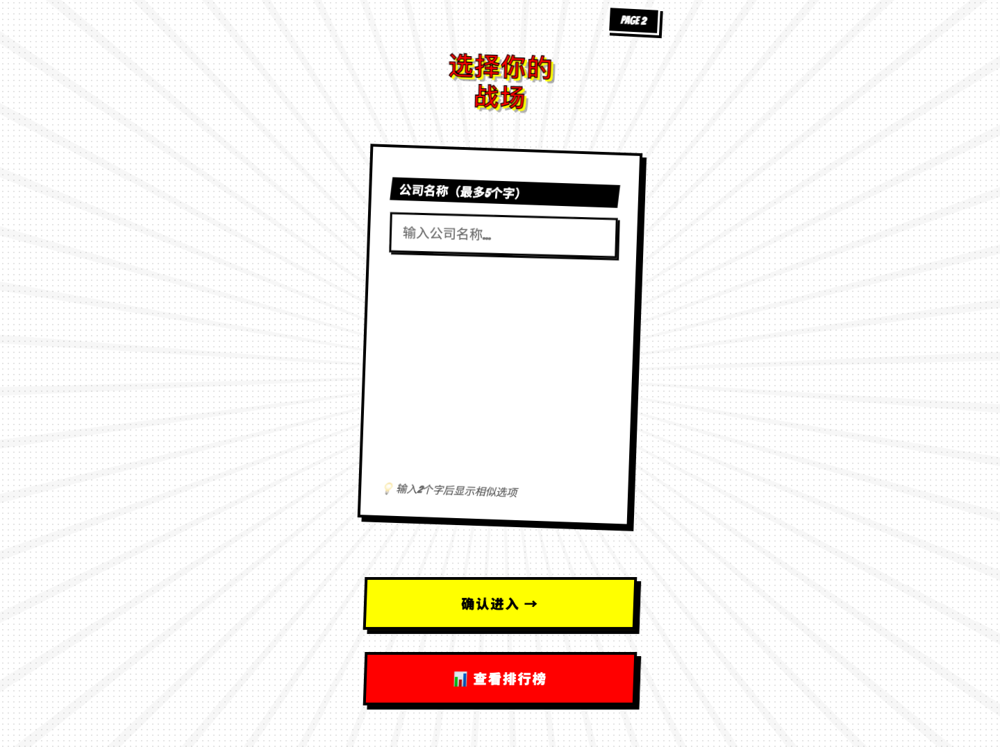
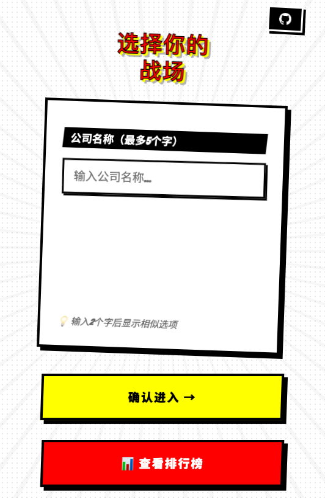
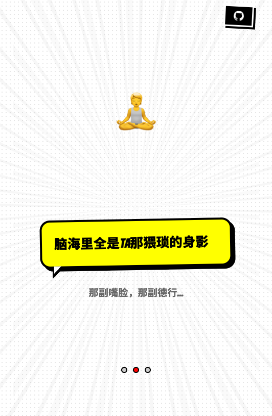
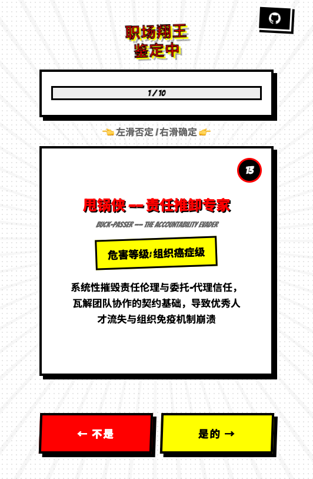
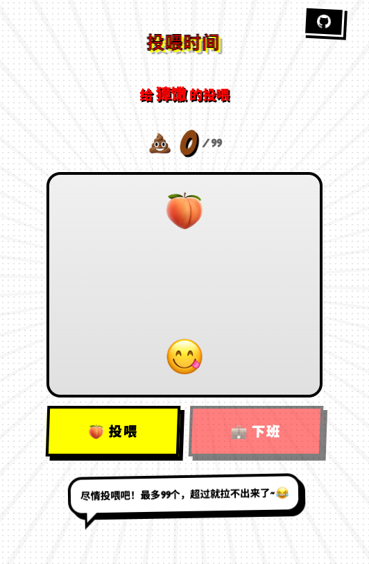
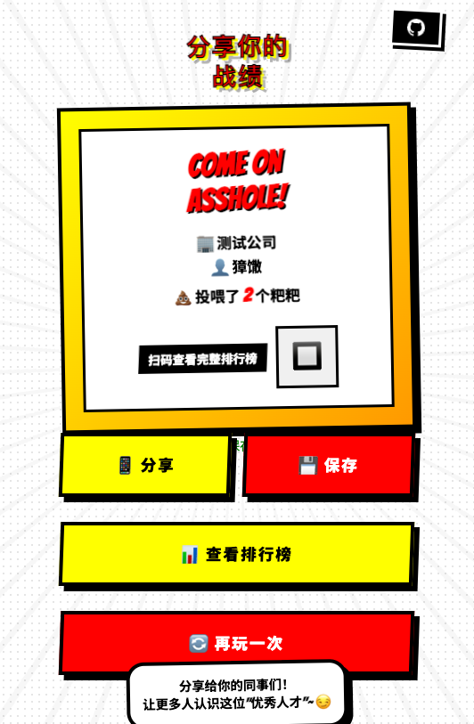
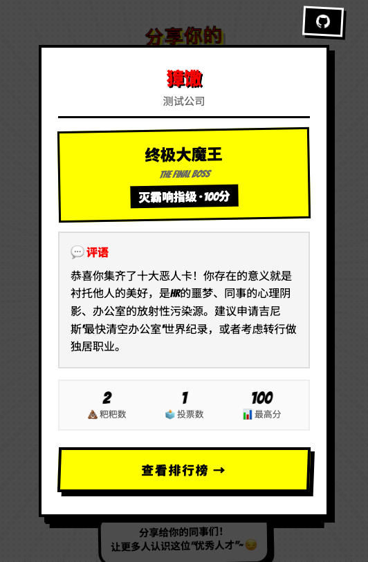

# 💩 Come On, Asshole! | 职场翔王鉴定器

<div align="center">

**"在这个全员恶人的时代，给你的同事一个应有的评价"**

*"In this era of universal villainy, give your colleagues the recognition they deserve"*

[](https://github.com/bionexit/come_on_asshole)
[](LICENSE)
[](https://github.com/bionexit/come_on_asshole)



</div>

---

## 🎯 这是什么？| What is this?

**中文：** 这是一个科学（并不）严谨的职场混蛋鉴定系统。通过十大恶人指标，精准定位你身边的"职场翔王"。不管是甩锅侠、马屁精还是负能量黑洞，都逃不过这套算法的制裁。

**English:** A scientifically (not) rigorous workplace asshole identification system. Through ten villain indicators, precisely locate the "King of Shit" around you. Whether it's buck-passers, sycophants, or energy vampires—none can escape this algorithm's judgment.

> 🎭 **职场如戏，全靠演技。但有些人，演都演不好。**
> 
> *"Workplace is theater, all about acting. But some people can't even act properly."*

---

## ✨ 核心功能 | Features

### 🗳️ 科学投票系统 | Scientific Voting System
- **10大恶人指标** | 10 Villain Indicators
  - 甩锅侠 Buck-Passer (13分)
  - 成果窃贼 Credit Thief (11分)
  - 马屁精 Sycophant (11分)
  - 双面阴阳人 Two-Faced (11分)
  - 负能量黑洞 Energy Vampire (10分)
  - ...and more!

- **智能评分算法** | Smart Scoring Algorithm
  - 根据选中项自动计算总分
  - 5个等级评价：净土守护者 → 终极大魔王
  - 5 Rating Levels: Sanctuary Keeper → Final Boss

### 💩 粑粑投喂系统 | Poop Flinging System
- 用emoji表达你的"敬意"
  - Express your "respect" with emojis
- 支持批量投喂
  - Bulk flinging supported
- 实时排行榜更新
  - Real-time leaderboard updates

### 📊 翔王排行榜 | Hall of Shame
- 公司内排名 | Company Rankings
- 全站排名 | Global Rankings
- TOP3 专属称号：👑翔王 / 🏆翔圣 / 🥉翔尊
- TOP3 Exclusive Titles: King / Saint / Master of Shit

### 🎭 详细评价报告 | Detailed Assessment Report
根据得分自动生成毒舌评语：

| 分数 | 等级 | 评级 |
|------|------|------|
| 0-20 | 净土守护者 Sanctuary Keeper | 人类之光 Beacon of Humanity |
| 21-40 | 瑕疵凡人 Flawed Mortal | 咖啡里的苍蝇 Fly in Coffee |
| 41-60 | 人形麻烦精 Human Hassle | 演技破坏者 Performance Destroyer |
| 61-80 | 移动灾难区 Walking Disaster | HR重点监控对象 HR's Most Wanted |
| 81-100 | 终极大魔王 Final Boss | 灭霸响指级 Thanos Snap Level |

---

## 🚀 快速开始 | Quick Start

### 安装 | Installation

```bash
# 克隆这个罪恶的仓库 | Clone this sinful repo
git clone https://github.com/bionexit/come_on_asshole.git

# 进入目录 | Enter the directory
cd come_on_asshole

# 安装依赖 | Install dependencies
npm install

# 初始化数据库（SQLite）| Initialize database
npm run db:init
```

### 开发 | Development

```bash
# 启动开发服务器 | Start dev server
npm run dev

# 打开浏览器访问 | Open browser
http://localhost:5173
```

### 构建 | Build

```bash
# 生产构建 | Production build
npm run build

# 预览构建结果 | Preview build
npm run preview
```

---

## 🛠️ 技术栈 | Tech Stack

- **前端框架** Frontend: React 18 + TypeScript
- **路由** Routing: React Router v7
- **样式** Styling: CSS3 + Comic Style Design
- **动画** Animation: GSAP
- **数据库** Database: SQLite (via Drizzle ORM)
- **构建工具** Build: Vite
- **部署** Deployment: Static Hosting Ready

---

## 🎨 设计理念 | Design Philosophy

### 美漫风格 | Comic Book Style
- 粗黑边框 | Bold black borders
- 鲜艳配色 | Vibrant colors (Yellow/Red/Black)
- 倾斜变换 | Transform rotations
- 拟声词效果 | Sound effect aesthetics (POW! BAM!)

### 交互体验 | Interaction
- 左右滑动手势 | Swipe gestures
- 拖拽效果 | Drag effects
- 粒子爆炸动画 | Particle explosions
- 音效反馈 | Sound effect feedback

---

## 📝 使用指南 | Usage Guide

### 投票流程 | Voting Process

1. **免责声明** Disclaimer → 确认你不是HR / Confirm you're not HR
2. **输入公司** Enter Company →  optional，保护隐私 / optional, for privacy
3. **冥想环节** Meditation → 平复情绪 / Calm your emotions
4. **开始投票** Start Voting → 左滑否，右滑是 / Swipe left (No), right (Yes)
5. **输入姓名** Enter Name → 支持自动打码 / Auto-masking supported
6. **投喂粑粑** Fling Poop → 表达你的爱意 / Express your "love"
7. **分享战绩** Share Results → 让世界知道 / Let the world know

### 评分标准 | Scoring Criteria

总分根据选中的混蛋类型累加：
Total score is the sum of selected asshole types:

- 🥇 **0-20分**: 人类之光，建议申请非遗保护
  *Beacon of humanity, deserves UNESCO protection*
  
- 🥈 **21-40分**: 咖啡里的苍蝇，恶心但还能挑出来
  *Fly in coffee—disgusting but salvageable*
  
- 🥉 **41-60分**: 演技破坏者，走到哪劈到哪
  *Performance destroyer—you strike everywhere*
  
- 🏅 **61-80分**: HR重点监控，建议配地下办公室
  *HR's most wanted—deserves basement office*
  
- 💀 **81-100分**: 灭霸级存在，建议转行做独居职业
  *Thanos level—consider hermit profession*

---

## 🤝 贡献指南 | Contributing

欢迎提交PR！无论是：
PRs welcome! Whether it's:

- 新增混蛋类型 | New asshole types
- 优化毒舌评语 | Better roast comments
- 修复Bug | Bug fixes
- 改进UI | UI improvements

**注意：请勿在真实职场使用此应用进行人身攻击**

*Note: Please don't use this app for real workplace harassment*

---

## 📄 许可证 | License

[MIT](LICENSE) - 你可以随意使用，但请记得给原作者留点面子

*You can use it freely, but please give the original author some face*

---

## 🙏 致谢 | Acknowledgments


- 特别感谢[kimi code](https://www.kimi.com/code).除了编写AI.md和大约2小时的对话以外,没有敲一行代码.这一句也是作者敲的
  *SPECIAL THANKS to [kimi code](https://www.kimi.com/code).Only carried for writing AI.md and approximately 2 hours of dialogs.This sentence is 100% written by author.*
- 感谢所有被迫害过的职场人提供的灵感
  *Thanks to all tortured office workers for inspiration*
- 感谢React团队让我们能优雅地吐槽
  *Thanks to React team for elegant ranting*
- 感谢每一位勇敢的"翔王"被投票者
  *Thanks to every brave "King of Shit" who got voted*

---

<div align="center">

**Made with 💩 and ❤️ by [bionexit](https://github.com/bionexit)**

*记住：职场不易，且行且珍惜。但如果有人太过分——欢迎来投票。*

*Remember: Workplace is hard, cherish it. But if someone goes too far—feel free to vote.*

</div>

---

## 📸 截图预览 | Screenshots

<div align="center">

### 📱 应用流程展示 | App Flow Showcase

<table>
  <tr>
    <td align="center"><b>1. 免责声明</b><br><i>Disclaimer</i></td>
    <td align="center"><b>2. 选择战场</b><br><i>Select Battlefield</i></td>
    <td align="center"><b>3. 冥想环节</b><br><i>Meditation</i></td>
    <td align="center"><b>4. 投票鉴定</b><br><i>Voting</i></td>
  </tr>
  <tr>
    <td></td>
    <td></td>
    <td></td>
    <td></td>
  </tr>
  <tr>
    <td align="center"><b>5. 揭露真相</b><br><i>Name Entry</i></td>
    <td align="center"><b>6. 投喂时间</b><br><i>Poop Flinging</i></td>
    <td align="center"><b>7. 分享战绩</b><br><i>Share Results</i></td>
    <td align="center"><b>8. 评价报告</b><br><i>Rating Report</i></td>
  </tr>
  <tr>
    <td></td>
    <td></td>
    <td></td>
    <td></td>
  </tr>
</table>

</div>

---

## 🔗 相关链接 | Links

- 🌐 **在线演示** Demo: [Click](https://asshole.biw.ac/)
- 📱 **GitHub** Repo: https://github.com/bionexit/come_on_asshole
- 🐦 **Twitter** Share: #ComeOnAsshole

---

<div align="center">

**⭐ Star this repo if you've ever met an asshole at work!**

**如果你在工作中遇到过混蛋，就给这个项目点颗⭐吧！**

</div>
